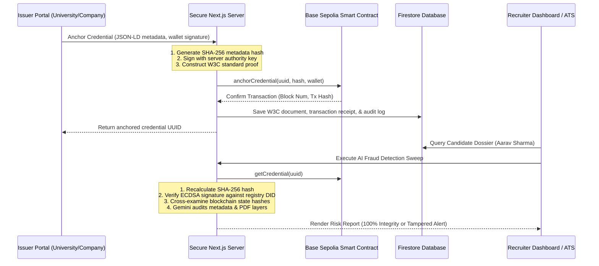

# AscendID — The Cryptographic Trust Layer for Talent

AscendID is an end-to-end decentralized talent identity protocol that cryptographically anchors W3C Verifiable Credentials to the Base Sepolia blockchain ledger, dynamically calculates candidate **Trust Engine Scores** (300-850), and uses Google Gemini AI to audit records for credentials forgery.

Developed as a highly polished, dark-futuristic Next.js application, it is optimized for high-fidelity hackathon demonstrations and production-grade deployments.

---

## 🏗️ System Architecture



---

## 🛠️ Technology Stack

- **Framework**: Next.js 16.2 (App Router & Turbopack)
- **Styling & UI**: Tailwind CSS 4.0, Framer Motion 12.0 (Micro-animations), Lucide Icons
- **Database & Auth**: Firebase Firestore (Security Rules-hardened), Firebase Auth
- **Blockchain Layer**: Solidity Smart Contracts, Viem Client (EVM registry integrations)
- **AI Engine**: Google Gemini API (`gemini-2.5-flash` client REST audits)
- **Local Mocks**: Isomorphic Local State Blockchain Provider (persists registry client-side to `localStorage` and server-side to `mock_blockchain_state.json` when RPC configs are blank).

---

## 📁 Repository Structure

```text
codebase/
├── contracts/               # Solidity Smart Contracts (Registry & Whitelists)
├── scripts/                 # Database seed scripts (National mock candidate dataset)
├── src/
│   ├── app/                 # Next.js App Router (Views, API Routes, Portals)
│   │   ├── api/             # Secure REST endpoints (Anchoring, Trust engine, Recommendations)
│   │   ├── gov/             # Government telemetry & leaderboards dashboard
│   │   ├── issuer/          # University issuance console & analytics charts
│   │   ├── recruiter/       # Candidate ranking, heatmaps, and AI fraud dashboard
│   │   ├── student/         # Digital Passport, Proof Graph, & Opportunities recommendation
│   │   └── verify/          # Public W3C QR Checkpoint verification portal
│   ├── components/          # Reusable client components (Proof Graphs, QR scanners)
│   ├── context/             # React states (Firebase Authentication Context)
│   ├── lib/                 # Core utilities (Firebase Admin, Isomorphic Providers)
│   └── services/            # Database hooks (Credential, Trust Engine, Students)
├── firestore.rules          # Security rules for Firestore read/write isolation
└── package.json             # Core dependency manifest
```

---

## 🚀 Quick Start Guide

### 1. Install Dependencies
Ensure you have Node.js 22+ installed:
```bash
npm install
```

### 2. Configure Environment Variables
Create a `.env.local` file in the root directory:
```env
# Firebase Client Credentials
NEXT_PUBLIC_FIREBASE_API_KEY=your-api-key
NEXT_PUBLIC_FIREBASE_AUTH_DOMAIN=your-project.firebaseapp.com
NEXT_PUBLIC_FIREBASE_PROJECT_ID=your-project-id
NEXT_PUBLIC_FIREBASE_STORAGE_BUCKET=your-project.appspot.com
NEXT_PUBLIC_FIREBASE_MESSAGING_SENDER_ID=your-sender-id
NEXT_PUBLIC_FIREBASE_APP_ID=your-app-id

# Blockchain Configuration (RPC & Authority Key)
BLOCKCHAIN_PRIVATE_KEY=your-evm-private-key
BLOCKCHAIN_RPC_URL=https://sepolia.base.org
NEXT_PUBLIC_BLOCKCHAIN_CONTRACT_ADDRESS=your-credential-registry-address

# AI Auditing Key
GEMINI_API_KEY=your-google-gemini-api-key
```
*Note: If no blockchain keys are configured, the app automatically runs in Mock Mode, simulating ledger confirmations isomorphic to local memory.*

### 3. Seed Database
Populate Firestore with a realistic National Dataset (20 Universities, 15 Companies, 100 Students, 1200 Credentials, 50 Tampered Items):
```bash
$env:GOOGLE_APPLICATION_CREDENTIALS="path/to/service-account.json"
npm run seed
```

### 4. Deploy Smart Contract (Optional)
Deploy contract registry on Base Sepolia using Hardhat:
```bash
npx hardhat compile
npx hardhat run scripts/deploy.ts --network base-sepolia
```

### 5. Launch Development Server
Start the local server:
```bash
npm run dev
```
Open **[http://localhost:3000](http://localhost:3000)** in your browser.

---

## 🎯 Presentation & Hackathon Simulation

For presentation pitches and live judging reviews, we have implemented an **Auto-Presentation Simulator**. It runs the entire end-to-end system sequence with zero manual inputs:

1. Navigate to **[http://localhost:3000/demo](http://localhost:3000/demo)**.
2. Click **Start Auto-Simulation**.
3. Watch the system perform live tasks:
   - IIT Bombay issues degree (triggers `/api/credentials/anchor`).
   - Student passport receives a push alert.
   - Cryptographic verification verifies signature hashes.
   - Base Sepolia blockchain confirms block heights.
   - Student's Trust Score FICO needle dial jumps to `785` (recalculated live).
   - Recruiter searches candidate, reviews verification lock, shortlists applicant.
   - Student receives an automated placement offer from Google India!
4. Presenters can **Pause / Resume** the simulation or adjust step pacing speeds dynamically during the pitch.
