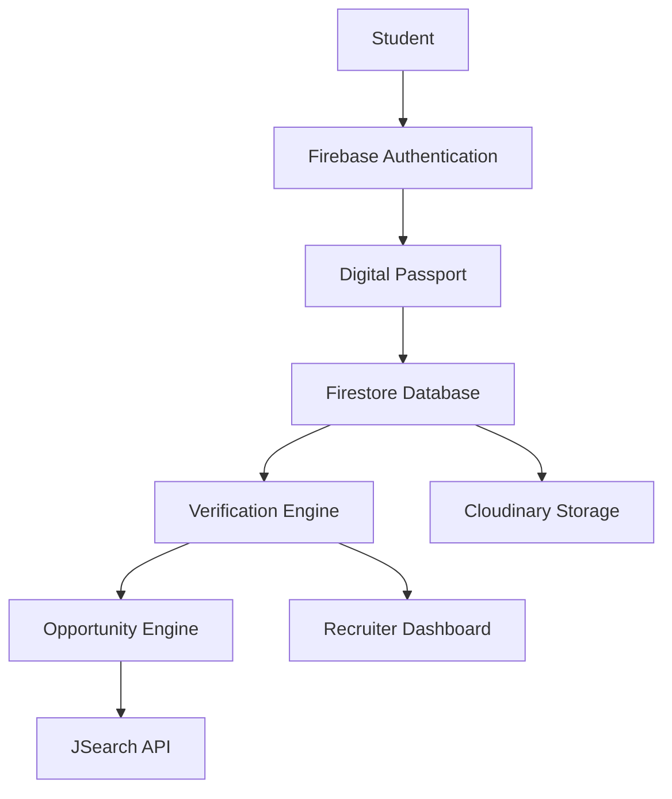
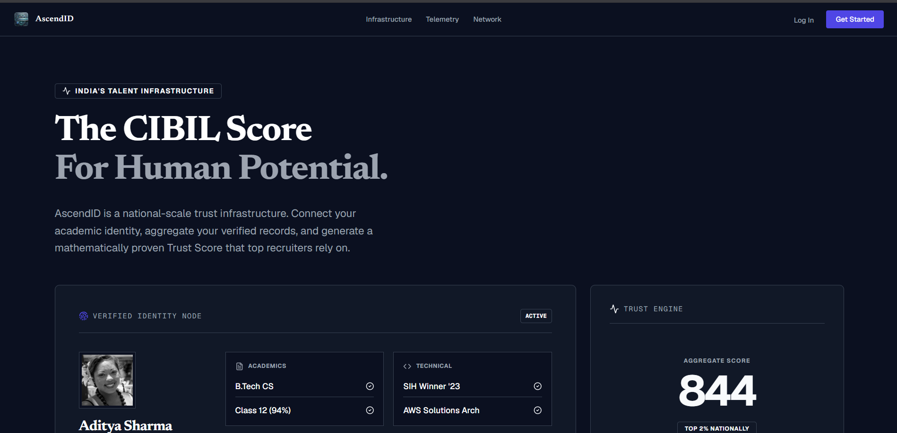
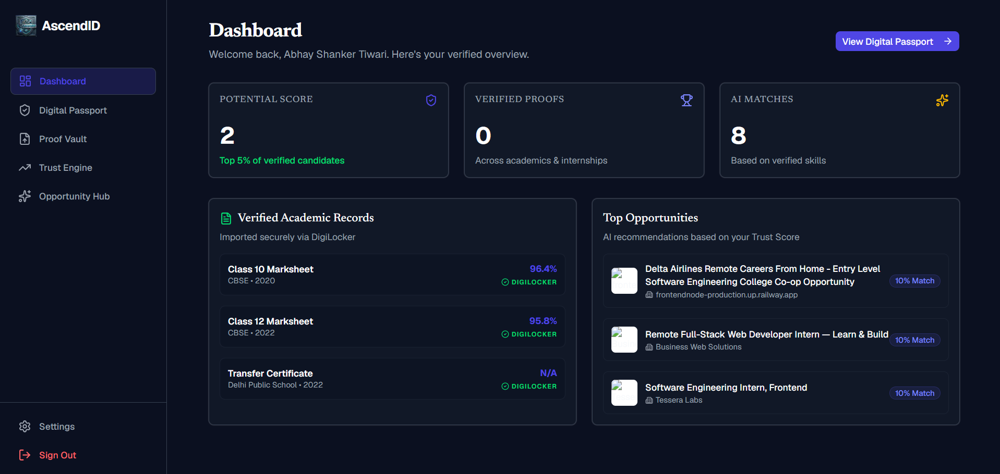
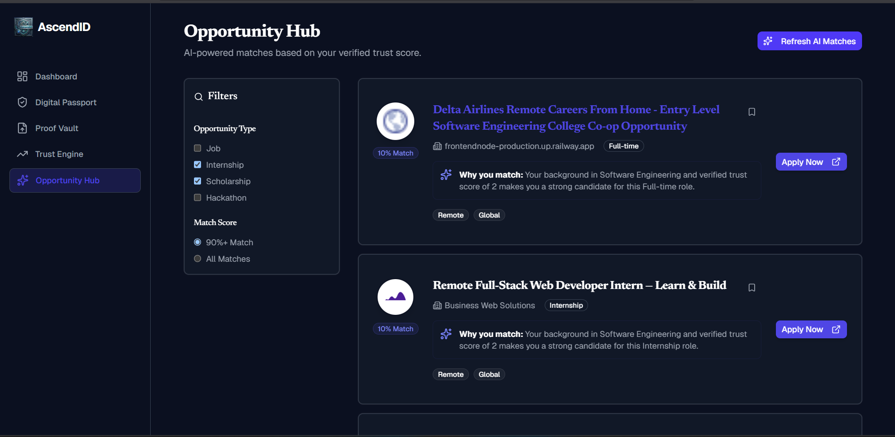
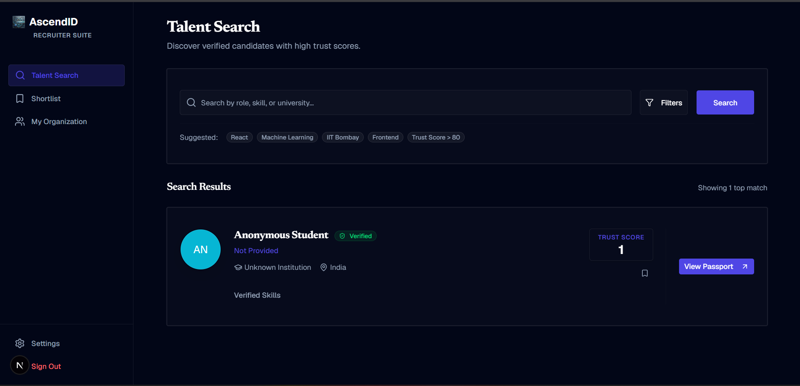

<p align="center">
  
</p>

<h1 align="center">AscendID</h1>

<h3 align="center">
Verified Potential • Trusted Opportunities
</h3>

<p align="center">
Building India's Talent Verification Infrastructure
</p>

<p align="center">


</p>

---

<p align="center">
  
</p>

---

## 🌍 The Vision

> UPI unified payments.
>
> DigiLocker unified documents.
>
> **AscendID unifies talent.**

AscendID is a next-generation verification infrastructure platform that combines academic identity, achievements, credentials, and opportunities into a unified digital passport.

Instead of repeatedly uploading documents and filling profiles across multiple portals, students create a single trusted identity layer.

Recruiters gain access to verified talent profiles, reducing hiring friction and improving trust.

---

## ⚡ Why AscendID?

<table>
<tr>
<td width="33%">

### 🎓 Students

* One Identity
* One Profile
* One Verification Layer
* Better Discoverability
* Reduced Application Fatigue

</td>

<td width="33%">

### 🏢 Recruiters

* Verified Candidates
* Reduced BGV Costs
* Faster Hiring
* Better Signal Quality
* Structured Profiles

</td>

<td width="33%">

### 🏛️ Institutions

* Trusted Credentials
* Centralized Records
* Verification Layer
* Better Transparency
* Digital Infrastructure

</td>
</tr>
</table>

---

## 🏗️ Platform Architecture



---

## 🚀 Core Features

| Feature                | Description                      |
| ---------------------- | -------------------------------- |
| 🔐 Authentication      | Google & Email Authentication    |
| 🎓 Academic Identity   | Academic Records Management      |
| 🪪 Digital Passport    | Unified Student Identity         |
| 📂 Proof Vault         | Secure Credential Storage        |
| 📊 Verification Index  | Verification & Readiness Layer   |
| 💼 Opportunity Engine  | Real Job & Internship Discovery  |
| 🏢 Recruiter Dashboard | Candidate Verification Interface |
| ☁️ Cloudinary Uploads  | Secure Document Upload System    |

---

## ⚙️ Technology Stack

<p align="center">


</p>

---
## 📁 Repository Structure

```text
codebase/
├── contracts/               # Solidity Smart Contracts (Registry & Whitelists)
├── scripts/                 # Database seed scripts (National mock candidate dataset)
├── src/
│   ├── app/                 # Next.js App Router (Views, API Routes, Portals)
│   │   ├── api/             # Secure REST endpoints (Anchoring, Trust engine, Recommendations)
│   │   ├── gov/             # Government telemetry & leaderboards dashboard
│   │   ├── issuer/          # University issuance console & analytics charts
│   │   ├── recruiter/       # Candidate ranking, heatmaps, and AI fraud dashboard
│   │   ├── student/         # Digital Passport, Proof Graph, & Opportunities recommendation
│   │   └── verify/          # Public W3C QR Checkpoint verification portal
│   ├── components/          # Reusable client components (Proof Graphs, QR scanners)
│   ├── context/             # React states (Firebase Authentication Context)
│   ├── lib/                 # Core utilities (Firebase Admin, Isomorphic Providers)
│   └── services/            # Database hooks (Credential, Trust Engine, Students)
├── firestore.rules          # Security rules for Firestore read/write isolation
└── package.json             # Core dependency manifest
```

---

## 🚀 Quick Start Guide

### 1. Install Dependencies
Ensure you have Node.js 22+ installed:
```bash
npm install
```

### 2. Configure Environment Variables
Create a `.env.local` file in the root directory:
```env
# Firebase Client Credentials
NEXT_PUBLIC_FIREBASE_API_KEY=your-api-key
NEXT_PUBLIC_FIREBASE_AUTH_DOMAIN=your-project.firebaseapp.com
NEXT_PUBLIC_FIREBASE_PROJECT_ID=your-project-id
NEXT_PUBLIC_FIREBASE_STORAGE_BUCKET=your-project.appspot.com
NEXT_PUBLIC_FIREBASE_MESSAGING_SENDER_ID=your-sender-id
NEXT_PUBLIC_FIREBASE_APP_ID=your-app-id

# Blockchain Configuration (RPC & Authority Key)
BLOCKCHAIN_PRIVATE_KEY=your-evm-private-key
BLOCKCHAIN_RPC_URL=https://sepolia.base.org
NEXT_PUBLIC_BLOCKCHAIN_CONTRACT_ADDRESS=your-credential-registry-address

# AI Auditing Key
GEMINI_API_KEY=your-google-gemini-api-key
```
*Note: If no blockchain keys are configured, the app automatically runs in Mock Mode, simulating ledger confirmations isomorphic to local memory.*

### 3. Seed Database
Populate Firestore with a realistic National Dataset (20 Universities, 15 Companies, 100 Students, 1200 Credentials, 50 Tampered Items):
```bash
$env:GOOGLE_APPLICATION_CREDENTIALS="path/to/service-account.json"
npm run seed
```

### 4. Deploy Smart Contract (Optional)
Deploy contract registry on Base Sepolia using Hardhat:
```bash
npx hardhat compile
npx hardhat run scripts/deploy.ts --network base-sepolia
```

### 5. Launch Development Server
Start the local server:
```bash
npm run dev
```
Open **[http://localhost:3000](http://localhost:3000)** in your browser.

---

## 🎯 Presentation & Hackathon Simulation

For presentation pitches and live judging reviews, we have implemented an **Auto-Presentation Simulator**. It runs the entire end-to-end system sequence with zero manual inputs:

1. Navigate to **[http://localhost:3000/demo](http://localhost:3000/demo)**.
2. Click **Start Auto-Simulation**.
3. Watch the system perform live tasks:
   - IIT Bombay issues degree (triggers `/api/credentials/anchor`).
   - Student passport receives a push alert.
   - Cryptographic verification verifies signature hashes.
   - Base Sepolia blockchain confirms block heights.
   - Student's Trust Score FICO needle dial jumps to `785` (recalculated live).
   - Recruiter searches candidate, reviews verification lock, shortlists applicant.
   - Student receives an automated placement offer from Google India!
4. Presenters can **Pause / Resume** the simulation or adjust step pacing speeds dynamically during the pitch.


## 🔄 User Journey

```text
Google Login
      │
      ▼
Create Profile
      │
      ▼
Import Academic Identity
      │
      ▼
Upload Proofs
      │
      ▼
Generate Verification Index
      │
      ▼
Opportunity Discovery
      │
      ▼
Recruiter Verification
```

---

## 📸 Product Showcase

### Landing Page



### Student Dashboard



### Proof Vault


### Opportunity Engine



### Recruiter Dashboard



---

## 🏆  Confluence 2.0 · Hackathon

**Team Name:** Tech_Lababdar

**Project:** AscendID

**Tagline:** Verified Potential. Trusted Opportunities.

Building the trust layer for India's next generation of talent.


